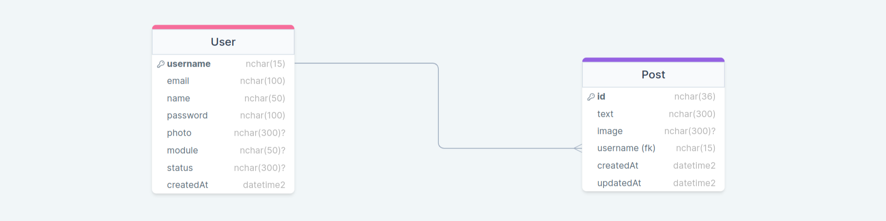
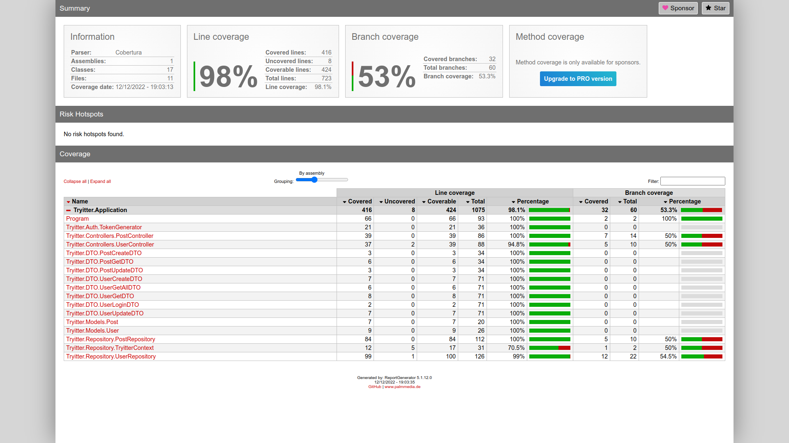
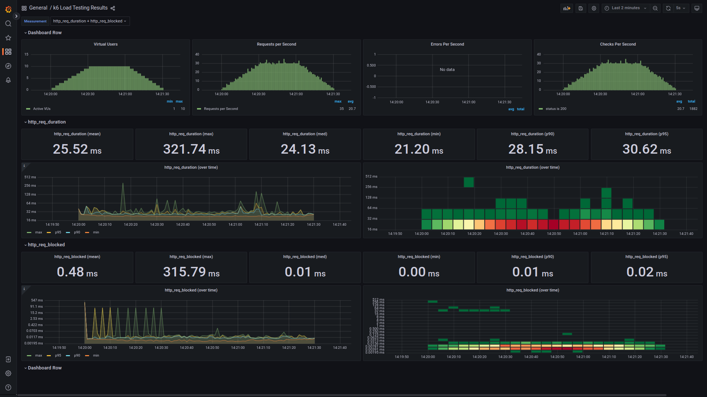
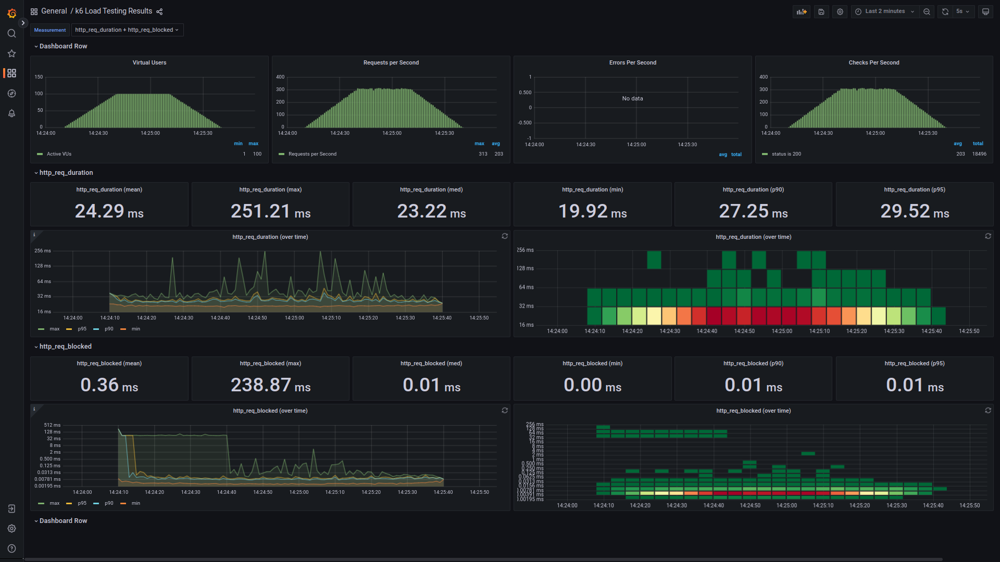
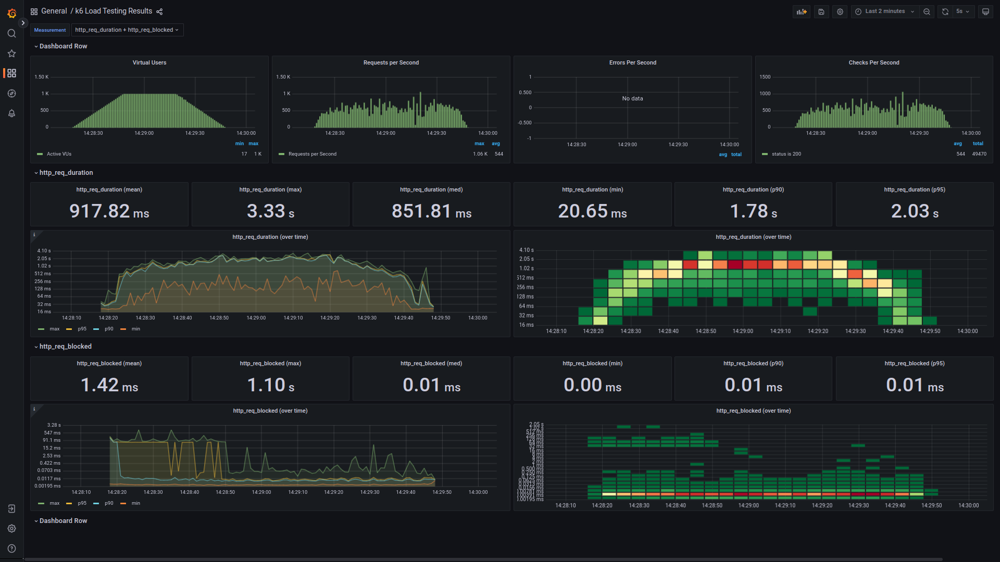

# Tryitter Application - Mário Júnior

<div align="center">
 
</div>
 
<h2 id="sobre">Boas vindas ao repositório da aplicação Tryitter</h2>

#### Esta é uma aplicação de _Back-end_ em `C#`, usando `.NET Core` para prover os serviços de um aplicativo de rede social baseado em texto.

A API foi desenvolvida seguindo padrão `Repository`, os princípios de arquitetura _web_ `REST` e utilizando-se de `POO`, conectando-se a um banco de dados `SQL Server` para a persistência das informações.

Para acessar a API e consumir seus serviços, faz-se necessário que a pessoa usuária cadastre-se e faça _login_ com suas credencias. Isso será autenticado pela ferramenta `JWT`, gerando um token seguro `JWT` (_JSON Web Token_), que servirá de autorização da sessão, e validação de acessos a alguns dos serviços disponíveis à pessoa usuária, enquanto conectada a aplicação.

## Responsável técnico por este repositório:
[**Mário JS Júnior**](https://br.linkedin.com/in/mariojr) - Software Engineer [XP Inc.](https://www.xpinc.com/)

<br />

# Planejamento

<h2 id="gestao">Gestão ágil do processo de Planejamento e Desenvolvimento</h2>

#### A gestão ágil de todo o processo de planejamento e desenvolvimento do desafio, foi executada com o apoio das metodologias `scrum` (_product backlog_, _sprint_ e simulações de _daily meeting_) e `kanban` (quadro de atividades).<br />

<strong>Quadro kanban inicial:</strong>

<div align="center">
 
</div>
<br />

<strong>Quadro kanban final:</strong>

<div align="center">
 
</div>
<br />

# Tecnologias utilizadas

&nbsp;
&nbsp;
&nbsp;
&nbsp;
&nbsp;
&nbsp;
&nbsp;
&nbsp;
&nbsp;
&nbsp;
&nbsp;
&nbsp;
&nbsp;

<br />

# Requisitos Técnicos
* Desenvolvimento da aplicação em `C#`, com `.NET Core` e com `Entity Framework` que é um _framework_ mapeador moderno de banco de dados de objeto para .NET. Dando suporte a consultas LINQ, controle de alterações, atualizações e migrações de esquema. Funciona ainda com muitos bancos de dados, incluindo o Banco de Dados SQL (local e do Azure);
* A API foi desenvolvida seguindo padrão `Repository`, os princípios de arquitetura _web_ `REST` e utilizando-se de `POO`, como já citado na introdução, por serem padrões e metodologias de desenvolvimento já consagrados;
* O banco de dados escolhido para a persistência das informações foi o `SQL Server`, por sua acessibilidade, confiabilidade, robustez e compatibilidade plena com o ecossistema `.NET Core` e o `Entity Framework`. Além de proporcionar opção de implantação (_deploy_) prática no serviço da `Azure`;
* Para os testes, considerando a aplicação em `.NET Core`, optei pela dupla `xUnit` (como _framework_/base para a melhor organização dos códigos de teste) e `FluentAssertions` (para as asserções, fornecendo formas de dizer ao código o que espero, testar e validar o retorno de forma fluente e intuitiva).
<br />

Dessa forma, necessitando ainda otimizar o recurso tempo, priorizei a filosofia de testes em `BDD` (_Behavior Driven Development_), onde fiz o desenvolvimento orientado ao comportamento dos requisitos do sistema/aplicação e usando linguagem mais próxima do negócio, desenvolvendo os testes em paralelo à codificação da aplicação;
<br />

<h2 id="database">Banco de Dados</h2>
<strong>Diagrama Entidade Relacionamento - Modelagem do Banco de dados:</strong>
<div align="center">
 
</div>

<br />

# Testes

<h2 id="tests-func">Testes Funcionais</h2>

### A aplicação teve `98%` de todas as suas principais funcionalidades testadas, em todas as camadas.<br />
Foram ao todo, `31 asserções`, entre `testes unitários e de integração`, todas devidamente confirmadas, com simulação de todas as dependências externas e isolamento completo do banco de dados.
<br />

<strong>Quadro de Cobertura de Testes:</strong>
<div align="center">
 
</div>
<br />

<h2 id="tests-func">Testes de Carga</h2>

### A aplicação foi testada com cargas de `10`, `100` e `1.000` VUs (usuários virtuais), `em ambiente de Produção`, no endpoint de `login`, `sem erros` e com as seguintes respostas:<br />
<br />

<strong>10 VUs</strong>
<div align="center">
 
</div>
<br />

<strong>100 VUs</strong>
<div align="center">
 
</div>
<br />

<strong>1.000 VUs</strong>
<div align="center">
 
</div>

<br />

# Documentação
### A documentação da Aplicação pode ser acessada em Produção pelo endereço:
[Tryitter.Application v1](https://tryitter-application.azurewebsites.net/index.html)

<br />

# Executando a Aplicação
<h2 id="local-run">Localmente</h2>

### Para execução local (exemplo de ambiente em sistema `Linux`), você precisará de:
- [.NET](https://learn.microsoft.com/pt-br/dotnet/core/install/linux)
- [dotnet CLI](https://learn.microsoft.com/pt-br/dotnet/core/tools/)
- [SQL Server](https://learn.microsoft.com/pt-br/sql/linux/quickstart-install-connect-ubuntu?view=sql-server-ver16)
- [Entity Framework](https://learn.microsoft.com/pt-br/ef/core/cli/dotnet)
- Ferramenta visual de administração de Banco de Dados.
> Recomendação: [Azure Data Studio](https://learn.microsoft.com/pt-br/sql/azure-data-studio/download-azure-data-studio?view=sql-server-ver16)
- Client HTTP à sua escolha:
> Recomendações: [Insomnia](https://insomnia.rest/download) | [Postman](https://www.postman.com/downloads/) | [Firecamp](https://firecamp.io/download)

### Clone o repositório

```bash
  git clone git@github.com:Mario-Junior/tryitter.git
```

Entre no diretório do repositório

```bash
  cd tryitter/
```

Instale as dependências do projeto

```bash
  dotnet restore
```

Entre no diretório da aplicação

```bash
  cd Tryitter.Application/
```

Suba as migrações (migrations) | `caso já não existirem`

```bash
  dotnet ef migrations add [nome-para-a-migration]
```

Conecte-se ao sistema de administração de banco de dados e suba o banco de dados

```bash
  dotnet ef database update
```

Suba o servidor local

```bash
  dotnet run
```

<br />

### Como os testes estão totalmente desacoplados de dependências externas, é possível executá-los a qualquer momento pelo comando

`Na pasta ./tryitter`

```bash
  dotnet test
```
<br />

# Aprendizados adicionais e melhorias
- Converter/encriptar dados sensíveis como Email, Password, etc. para hash;
- Arquivo de variáveis de ambiente (`.env` ou outro);
- Conteinerização da aplicação;
- Usar contratos via Interfaces;
- Implementar “modo rascunho” (_draft_).
